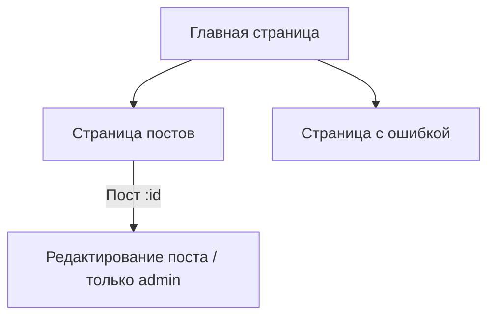

# Практическое задание 15: Guard

- [x] **Задача**: Создать приложение с ролевой моделью, по тематике отображения постов.

**Общая информация**

- [x] Создать приложение с ролевой моделью. Оно должно содержать сервис, компоненты, один `guard` и типовую верстку. Данные для постов можно взять [отсюда](https://jsonplaceholder.typicode.com/posts).
- [x] Приветствуется стилизация ( любой UI фреймворк ).

**Приложение должно содержать:** 

- [x] 1. Сервис с ролями пользователя либо администратора (пользователь по умолчанию).
- [x] 2. Верстку страницы с ошибкой.
- [x] 3. Функционал смены роли, кнопки смены ролей (admin/user).
- [x] 4. Главная страница должна содержать `NavBar` для перехода по основным ссылкам, кроме страницы с ошибкой.
- [x] 5. В `Guard` реализовать функцию: при несоответствии роли должен быть автоматический переход на страницу с ошибкой.
- [x] 6. Переход на главную страницу из любой части приложения.
- [x] 7. Подробный просмотр поста (`:id`) должен отображать отдельный шаблон с данными выбранного поста.

**Иерархия маршрутов**

