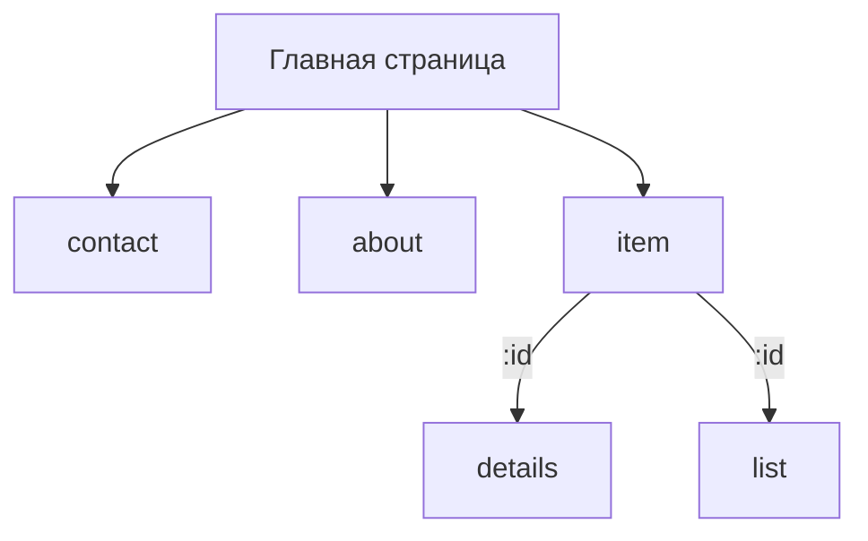

# Практическое задание 4: Маршрутизация в приложении

Создать новые компоненты и организовать роутинг под такую иерархию.

В компоненте `details` вывести в консоль браузера, текущий параметр маршрута
При переходе на компонент `list` сделать параметр запроса `list=1` и `enable=true`
Прислать ссылку на репозитории на `GitHub` или `GitLab`, для проверки выполнения, в ответе к этому заданию.
