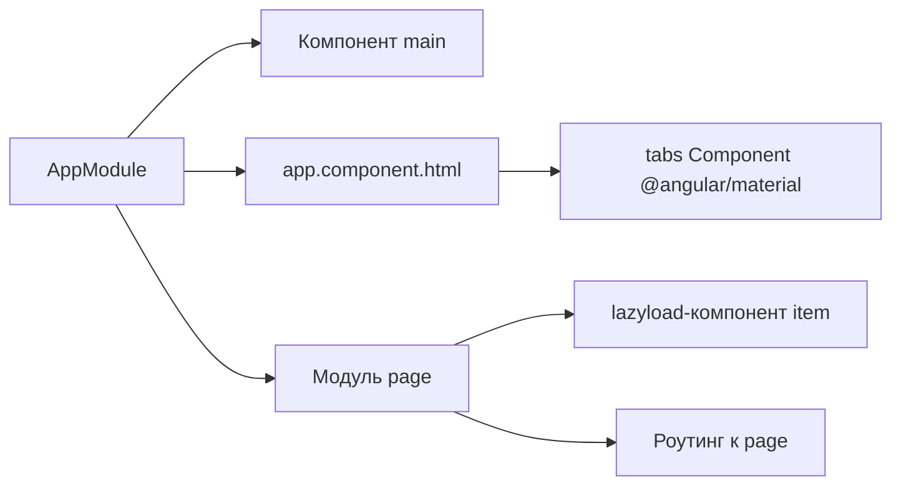

# Практическое задание 5: Модули

1. Создать приложение
2. Создать компонент main
3. Создать модуль с роутингом page
4. В модуле page добавить компонент item
5. Сделать компонент item lazyLoad загрузку
6. Добавить @angular/material
7. Интегрировать [tabs-компонент](https://material.angular.io/components/tabs/overview)
8. Прислать ссылку на репозитории к ответу на это задание

Должна получится такая структура приложения:

